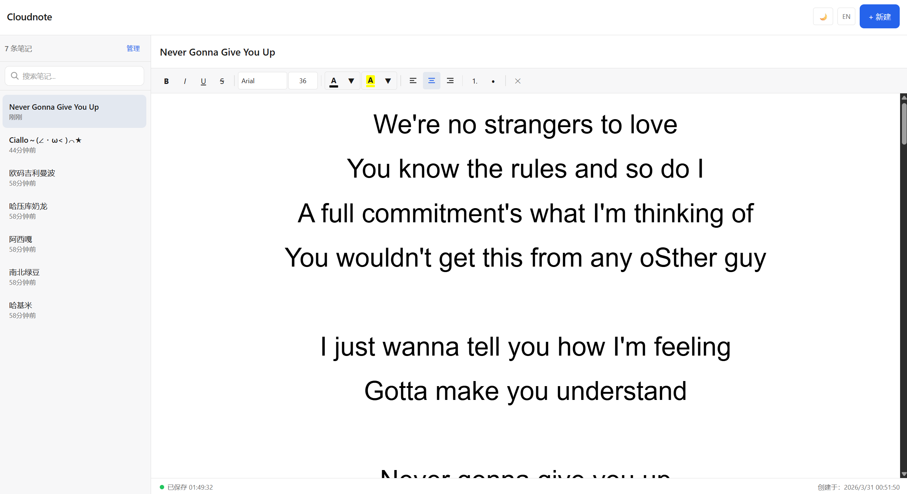
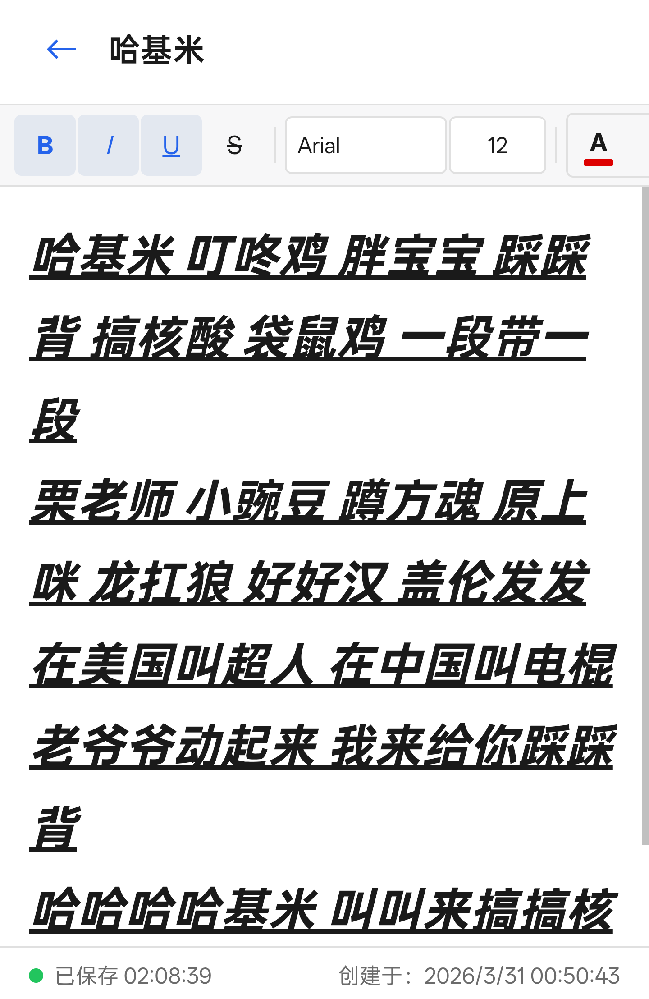

# Cloudnote

[English](README_EN.md)

基于 Cloudflare Workers + KV 的轻量级云端记事本。无需服务器，部署在 Cloudflare 全球边缘网络，访问速度快、零维护成本。





## 功能

- **富文本编辑** — 加粗、斜体、下划线、删除线、字体颜色、高亮、对齐方式、有序/无序列表
- **字体与字号** — 支持中英文常用字体，Word 标准字号（8~72pt），可自定义输入任意字号
- **自动保存** — 输入后 1 秒自动保存，状态实时显示（保存中/已保存/保存失败自动重试）
- **笔记管理** — 目录浏览、搜索笔记、单条删除、批量删除
- **密码保护** — 可选的 Bearer Token 认证，保护笔记隐私
- **中英双语** — 支持中/英文界面切换，默认根据浏览器语言自动选择
- **暗色主题** — 亮色/暗色切换，默认跟随系统，选择持久化
- **移动端优化** — 响应式布局，移动端单栏切换，触摸友好
- **零依赖** — 单文件应用（API + 前端），无需构建工具

## 部署

### 前提

- [Node.js](https://nodejs.org/) 已安装
- [Cloudflare 账号](https://dash.cloudflare.com/sign-up)

### 步骤

1. **克隆项目**

```bash
git clone https://github.com/EdLovecraft/cloudnote.git
cd cloudnote
npm install
```

2. **登录 Cloudflare**

```bash
npx wrangler login
```

3. **创建 KV 命名空间**

```bash
npx wrangler kv namespace create NOTES
```

将输出的 `id` 填入 `wrangler.toml` 中的 `<YOUR_KV_NAMESPACE_ID>`。

4. **设置密码（可选）**

```bash
npx wrangler secret put PASSWORD
```

输入你的密码。不设置则无需密码即可访问。

5. **部署上线**

```bash
npm run deploy
```

部署完成后会输出你的访问地址，如 `https://cloudnote.你的子域名.workers.dev`。

## 许可证

MIT
